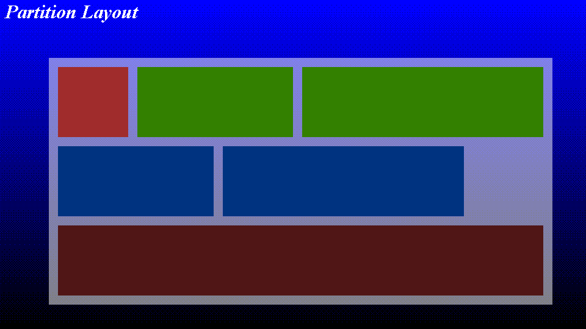
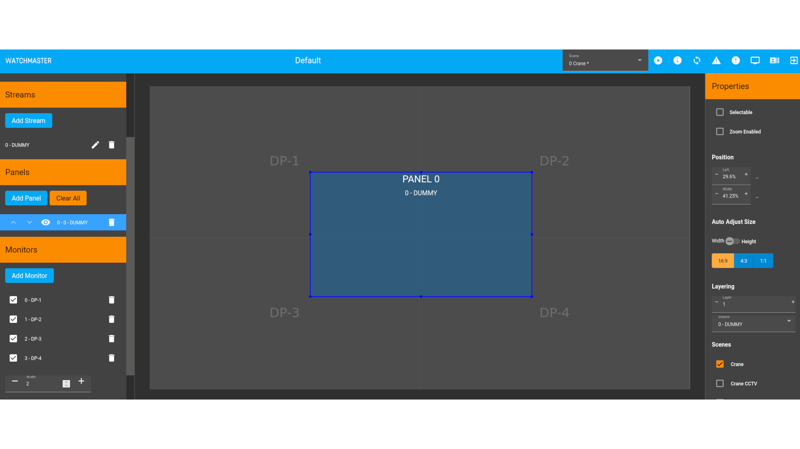
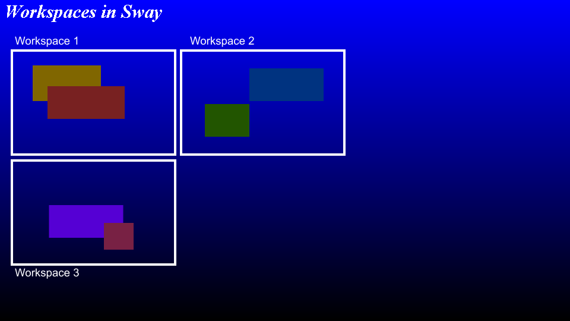
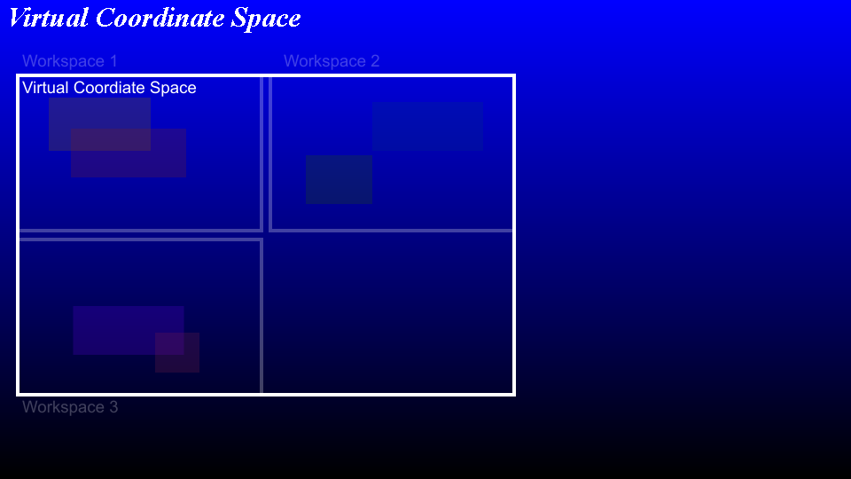
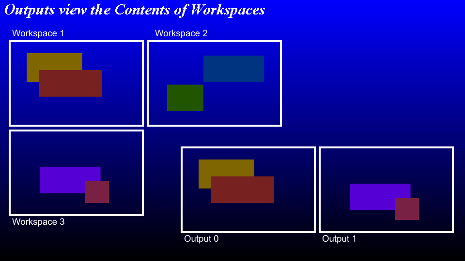

# Running on a General Purpose Computer

Video Wall makes use of several common Linux components that are also used in
the general Linux desktop and server configuration:

* GRUB
* systemd
* Video Interface: DRM and KMS
* Weston, sway and Wayland

## GRUB



The "Grand Unified Bootloader" this is responsible for getting the kernel into
ram along with an initial ram fs then allowing the kernel to run.

This kind of tomfoolery was not necessary, now there is also an "EFI Boot
Stub" that means a UEFI system can boot the kernel without the need for a
bootloader.

The video wall project must support a way for features to be added and the
system updated. GRUB plays an important role in choosing the correct system
to boot.

The architecture is simple, there are 6 partitions:

* EFI Boot (FAT32)
* Kernel A
* Kernel B
* Root Filesystem A
* Root Filesystem B
* Persistent user data

This allows a complete system to be installed and verified before switching
to the just downloaded system which could potentially be corrupt.

Downloading a new system would involve updating the currently unused
partitions and then updating the GRUB configuration to use the new
installation once verified.

## systemd

The system is started and maintained by `systemd`, the somewhat controversial
user space management octopus that has wormed it's way into most modern Linux
distributions. It is not accurate to say that `systemd` is just another init
system, it is not. `systemd` is a whole way of managing the underlying
operating system from network management with `systemd-networkd` to firewall
control with `firewalld`.

Although not directly related to `systemd` our project recently had an issue
with the "predictable interface naming" feature that, despite the network
interface card being in the same physical slot decided to name it differently.
This is unfortunate since our configuration relied on this predictable name
that turned out to me somewhat unpredictable.

* [PREDICTABLE INTERFACE NAMES](https://github.com/systemd/systemd/blob/main/docs/PREDICTABLE_INTERFACE_NAMES.md)

## Video Interface: DRM and KMS

The video wall must be aware of the connected output devices. The management
software is used to configure the virtual surface to be displayed on specific
monitors. There are several ways of 



* Slide of video wall web management interface

There are several interfaces available to draw graphics on a video interface.
In Linux some low level interfaces are DRM and KMS. As we discussed earlier
our project requires the acceleration offered by the Vulkan interface to a
GPU. Interfaces to Vuklan using these low level interfaces was fairly
complicated and there was no obvious path available at the time. As this is an
essential portion of the video wall project we looked for an alternative, the
chosen, well supported alternative was to make use of a Vulkan extension that
interfaces with a Wayland compositor via an extension
(`VK_KHR_wayland_surface`) which allows rendering via Vulkan to a surface
object in a compositor via the Wayland protocol.

## Weston, sway and Wayland

Wayland is not a programme but rather it is a protocol, it is object oriented
and is based on passing messages over a socket to a compositor which will then
perform the actions requested. This is similar in spirit to X11 but with a
clean slate much of the so-called "cruft" may be removed. Many modern
distributions make use of a Wayland compositor and creating a new product that
does not would perhaps be foolish.

Originally the project opted to use the Weston compositor which has a very
basic kiosk mode, that would have been sufficient except that the kiosk mode
had some unfortunate bugs which had been worked around in a way that was
not acceptable to our project. There is some argument over if this is a
protocol error or an implementation problem but in Weston the process of
removing a display and attaching another is somewhat unintuitive.

The Wayland protocol has a series of protocol messages related to the concept
of an `output`. A client is notified of an output object when it is created,
created meaning when the application connects to the compositor or when an
output device is connected.

According to the protocol documentation the registry `wl_registry` will
announce new `wl_output` objects at startup and when a monitor is hotplugged:

```
This object is published as global during start up, or when a monitor is hotplugged.
```

Simple, but not quite what Weston will do. In the case that a monitor is
disconnected Weston does not notify it's clients but rather will do nothing
until another monitor is connected. At which time Weston will notify the
connected client that the output has been removed by sending a message via
the `wl_registry`. This is to prevent some kind of race condition, for example
of the compositor were to remove the output when the monitor was disconnected
there is a time when the client may interact with the output when the output
does not exist. This presents a problem because there is no way, specified
in the protocol to notify the client that the message sent was to an invalid
object but that the error is non-fatal. `wl_display` has an `error` event
but this is used for fatal errors and the protocol expects that a client
should disconnect from the server should an error event be received.

`sway` is another compositor that supports the Wayland protocol and will
render things to a monitor. It will also remove `wl_output` proxies (via
the `wl_registry`) when they are physically unplugged. Messages sent to an
unplugged output are presumably discarded (TODO: read some of the source
code in `wl_roots` to find out).

Unfortunately, as `sway` is a much more capable compositor than the Kiosk mode
of Weston we have some new problems.

[Wayland Book](https://wayland-book.com/) written by Drew DeVault, still
incomplete but has a lot of useful information for writing a Wayland client
or compositor without a framework like qt or GTK.

### sway and virtual desktops







* Slide showing surfaces, workspaces and outputs.

Before I continue I must introduce a new term: "surface" this is effectively
a window. It is a rectangular area on the compositor that will contain the
running application's frame buffer. Surfaces have a size and a location in the
compositor's global coordinate space. In sway, and many other compositors,
there is another level of indirection known as a workspace. The rules of sway,
not the Wayland protocol, say that an output will contain a single workspace
and also that a workspace will be associated with an output.

When a monitor is removed the user can nolonger see the output on that
display and in sway a workspace is assigned to an output. Of course it is not
much use if you cannot see the application surfaces that may have been present
on that output. If the disconnected output was displaying the focussed
workspace then sway will display that workspace on one of the other connected
outputs.

This is where we begin to see a problem...

DEMO: Video of unplugging a monitor and the effect on sway

