# LU Industry Speaker Lecture

# Introduction and Rinicom

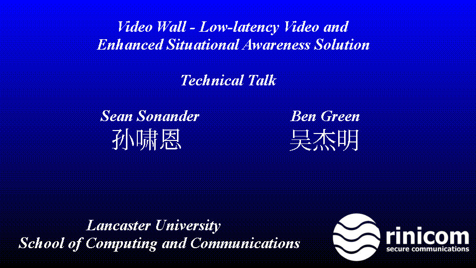

* Slide contains
  * Video Wall - Low Latency Video and Enhanced Situational Awareness Solution
    Technical Talk
    Sean Sonander and Ben Green
    孙啸恩 and 吴杰明
    Lancaster University
    School of Computing and Communications
    Bottom Right Corner: Circle Logo and Text: Rinicom Secure Communications

Hello and welcome to this presentation on Video Wall, a low latency video and
enhanced situational awareness solution developed by us for the company we
work for: Rinicom. I am Ben and you have already met Sean.

# Problem / Domain Setting (10 minutes)

The success of a company has always been in the efficiency of operation and
the safety of people that execute those operations.
Safe, happy employees are productive and create value. Unsafe employees are
concerned over their wellbeing, unhappy, will get hurt and do not create
value. One of our customers said: "If it is dangerous, boring or labour intensive
a machine should be doing it". I agree with this except perhaps if it is not
possible or unfeasable; in this case a machine should at least be helping.

Bearing that in mind the video wall solution helps customers by composing video
displays from relevant sources: cameras and other near real time data, and
presenting it with minimal latency.

Rinicom is proud to work alongside heavy equipment manufacturers and users
to enhance their day-to-day work and create a safer working environment. The
first major use of the video wall product was on cranes in a maritime environment.

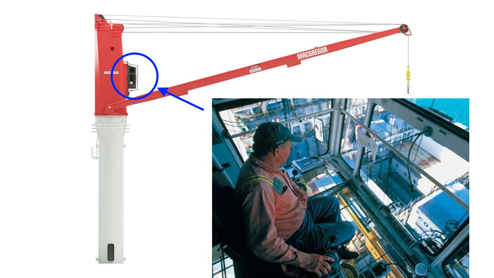

* Slide with Crane Operator
  Image of a Crane with the operator cabin highlighted in a blue circle
  There is also an image of a man sitting in a crane cabin with an arrow
  to indicate where on the crane image the man is located

Cranes are dangerous and the traditional location for a crane operator is in
the cabin, from there they have a reasonable view of the work area... that is:
if it were 1930. Most modern large cranes have cameras strategically located to
improve the operators view, often these images are presented on monitors in
the cabin and are of great day-to-day benefit to the operator. They afford
a clear unobstructed view of the working area leading to safer, more effective
crane operation.

When operating a crane an operator is still frequently located in the cabin.
However, relocating that operator to a control room also has great benefits.
Multiple operators can work along side each other, allowing for easy work sharing
and rapid hand-over at shift change. A control room is also more comfortable which
reduces fatigue and stress on the neck and back. Finally, it obviates the need
to climb up to the cabin leading to a safer working environment.

* [Port Technology International: Moving Crane Operations](https://www.porttechnology.org/technical-papers/moving_crane_operations_to_the_control_room_what_can_we_learn_from_process/)


* Slide with Crane falling
  Title of Slide: STS Crane at Keelung
  Image of a large red cargo ship containing new STS cranes beside an STS crane
  on land (to the right) falling backwards after being hit by the crane on the
  ship.

Ooops :-(

This crane fell down on 2024-10-16 (Monday) at 14.00 with no loss of life. We would
like to think that these catastrophic events can be made a little safer through the
application of technology like video wall.

[New STS Crane topples old STS Crane at Keelung](https://maritime-executive.com/article/video-new-sts-crane-topples-old-sts-crane-at-keelung)

Besides cranes, the video wall will also be an important component in the safety of
light rail travel.

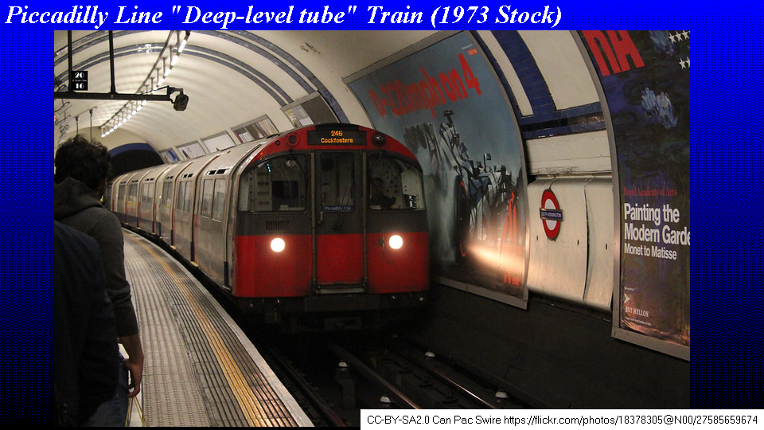

* Slide with London Underground platform
  Title: Piccadilly Line "Deep-level tube" Train (1973 Stock)
  License (CC-BY-SA2.0) and attribution to author of photograph (Can Pac Swire) and location taken from [https://flickr.com/photos/18378305@N00/27585659674](https://flickr.com/photos/18378305@N00/27585659674)

London underground is the oldest underground passenger railway network in the
world, dating back to 1863. The trains on the Piccadilly Line also known as
"Deep-level tube" trains have been in service since 1975 and are amoungst the oldest on
the network, younger only than the trains on the Bakerloo line, and are due to be
replaced by new Siemens trains that will hopefully enter service at the end of
2025. Rinicom has been working with Transport for London and alongside Siemens
subcontractors to integrate the video wall solution into these new trains.

* [Piccadilly line](https://en.wikipedia.org/wiki/Piccadilly_line)
* [London Underground 1973 Stock](https://en.wikipedia.org/wiki/London_Underground_1973_Stock) (entered service in 1975)
* [Picadilly Line Train](https://flickr.com/photos/18378305@N00/27585659674)
* [Bakerloo line old Trains Replaced by 2030](https://www.standard.co.uk/news/transport/bakerloo-line-old-trains-replaced-2030-tfl-london-underground-b1185888.html)

Transport for London's Safety, health and environment annual report states that in
2022/2023 there were 8112 reports of customer injuries on the transport network,
including 214 serious injuries and 4 deaths. The video wall solution will be used
to composite the CCTV images into a single image that will be displayed to the
driver when the train is in the station. The purpose of driver CCTV is safety
and so we hope this system will help keep those numbers low.

TODO: find specific numbers for Underground injuries and deaths.


* Side demonstrating latency problem

Low latency for the video wall is what the marketing department refer to as a maximum
time from "Glass-to-Glass". Of course what is actually meant by that is time taken
from photon acting on the camera sensor to the destination display reacting. More
accurately this could be referred to as "sensor to pixel latency".

The low-latency requirement presents several problems that are often also the concern
of user interface developers and, are of the utmost importance for game developers.
Game developers are normally concerned with response times from input devices, besides
the obvious keyboard and mouse, network interfaces are also devices which are within
the realm of concern for input latency... if that input is via the network!


## Graceful Degradation

Another important requirement for the London Underground project is that the
display degrade gracefully, allowing the driver to see some image in the face
of network problems.

# Video Display

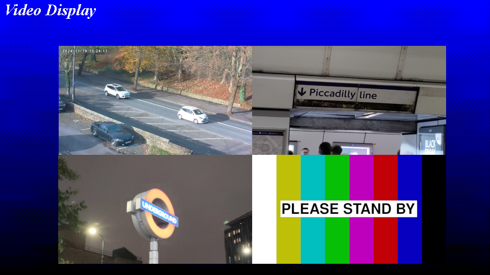

* Slide: Image composed of 4 different images.
  Top Left Image: Cars on a road
  Top Right Image: A sign that says "Picadilly" at a London Underground Station
  Bottom Left Image: The London Underground Roundel at night time
  Bottom Right Image: Test-card style image with the text "PLEASE STAND BY"

A display is made up of pixels, surprise!

Our aim for video wall is to alter those display pixels within the latency
specified based on the input from cameras and telemetry information.

Video Wall makes use of standard PC hardware to provide a final composited
image which may be displayed on the local display or encoded to transmit
the image across a network to be decoded and displayed.

Firstly I will discuss the primary input provider of the system: a camera.
Typical IP cameras will provide a stream in h.264, this will add latency
over a raw format but there are benefits in bandwidth usage.

Typically the CCTV in use will be 1280x720 or 1920x1080.

720p at 60Hz encoded at 24bpp requires a constant 1.24Gbps which is beyond
a normal network interface card which often support 1Gbps. The raw figure
also does not include any link-specific data added to the head and tail to
compose an ethernet frame or the IP and UDP headers.

To reduce the size of the data the stream will be encoded, but before then
a process of colour conversion and quantisation must take place.

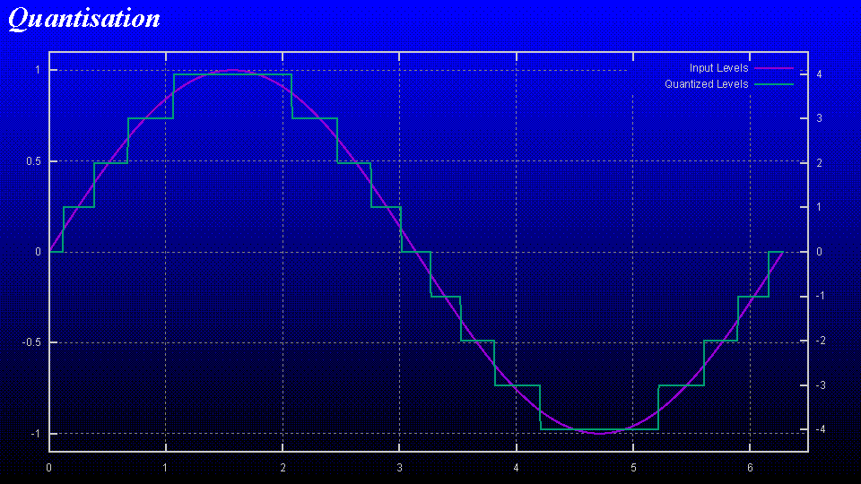

* Slide: Quantised Sine Wave

There is a lot to be said about sampling, Nyquist–Shannon sampling theorem is
a good place to start.

## Encoding Video: Colourspace Conversion

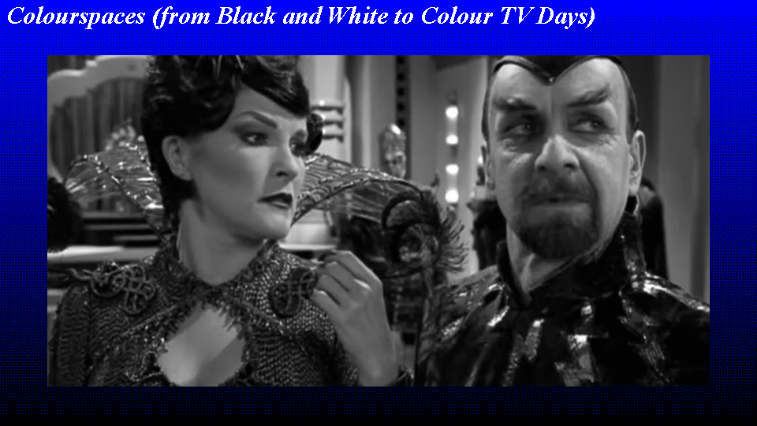

* Slide: Black and White image of Captain Janeway and Chaotica from the
  television series Star Trek Voyager

This technique was originally developed to encode colour information into an
analogue television signal whilst maintaining compatibility with black and
white television sets. Chrominance data was encoded with quadrature amplitude
modulation and added to the existing luminance signal as a using a colour
subcarrier. The signal was encoded and decoded using purely analogue
electronics, truely amazing. It was possible, if you had a black and white
set, to see the high frequency colour information... if you knew what you
were looking for!

[How PAL Colour Television Works](https://www.csse.canterbury.ac.nz/greg.ewing/c64_pal_decoder/PAL/PAL-Video-Encoding.html)

Why does this matter to us? Why not keep RGB since we don't have black and
white television sets anymore...

## Colour Down Sampling


* Slide: YCrCb and Downsampling
  Four pictures of the same barn, one in full colour, the next in greyscale
  (the Y component) then the Cr and Cb components respectively.
  [image used](https://en.wikipedia.org/wiki/YCbCr#/media/File:Barns_grand_tetons_YCbCr_separation.jpg)

The eyes are more sensitive to changes in luminance than chrominance (that is
to say that we notice changes in light much more easily than changes in colour)
to take advantage of this some colour information may be discarded during the
encoding process. This process is typically performed by dedicated hardware
in a camera and can be accelerated by special instructions on a general purpose
CPU (for example SSE instructions can be used to optimise colour format
conversion).

## Video Compression Picture Types

Video is encoded into three different video compression picture types aka
frame types, these are I, P and B:

I frame: (intra-coded frame) a complete image, like a PNG or JPEG
some encoded data streams are made completely of this type of frame. MJPEG
being the most obvious example.

P frame: (predicted frame) a frame that comes after an I frame and
relies on data in the frames that came before it to make a complete picture.

B frame: (bidirectional predicted picture) relies not only on the data
contained in frames that came before but in the data contained in frames that
come after.

P and B frames will contain some image data and motion vectors to move
and make use of data present in images before and, in the case of a B frame,
after itself.

## Output of Encoding Process

The result is a structured stream of bytes that can
be decoded to reproduce the source image sequence.

## Transmission

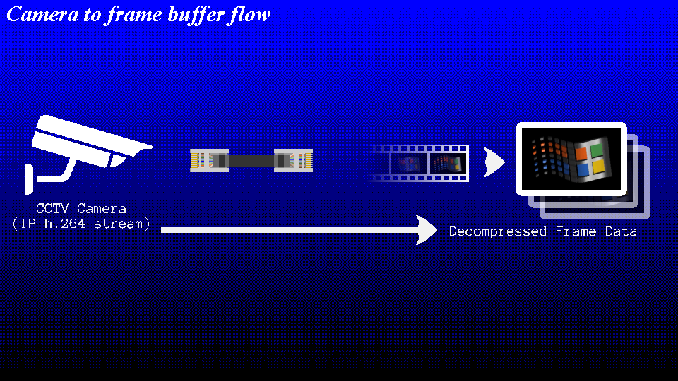

* Slide: CCTV Camera and Ethernet Cable

The structured bytestream must be transmitted over a network, at the very
least this will require demultiplexing but in addition some FEC codes may
be added to protect the stream.

## Sources

Video wall uses the term source to refer to a stream of images that come
from a network camera, local frame grabbing hardware or a widget (more on
those later). For simplicity I will only discuss IP cameras now but the
same methodology is used for other sources.

A source is responsible for maintaining the connection with the IP camera
and providing the compositor with all the data required to use the source
data in the final composed frame.

## Overview of Video Wall Source Architecture


* Slide: Camera to frame buffer flow
  Picture of a camera and representation of a frame buffer demonstrating
  a flow of image data over an RJ45 cable (symbolising ethernet) to a
  process which processes an h.264 stream to a frame buffer in the memory
  of a computer system

Video wall sources make use of open-source components like ffmpeg and
gstreamer to decode the video into a raw pixel format.

Once the frame data has been decoded into the frame buffer the job of the
source is complete for that frame and the source will continue to the next
frame.

Now that the frame has been delivered to the frame buffer the next stage of
the process can begin: Compositing.

# Compositor

The compositor is the process in the video wall that reads the frames from
the input buffers and creates an output buffer at a certain frame rate that
may not be the same as the input sources.

## Video Wall Architecture - General

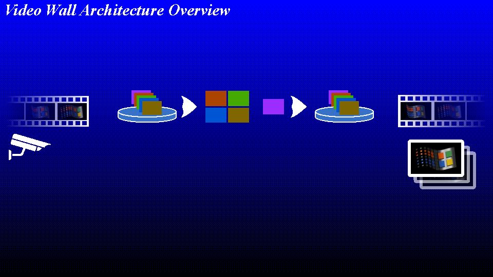

* Slide: Image of data flowing from camera to a display via buffers and a compositor

A monolith application is often frowned upon these days but in the cases where
many components need to communicate large amounts of data they can present
some advantages. Access to memory from different threads running in a common
address space is simple and efficient in comparison to copying or transfer via
network. Unfortunately it also presents a single point of failure, any thread
that misbehaves through invalid dereference of memory or writing into a
location it was not supposed to could cause the whole system to fail. For
these reasons the video wall has chosen to separate the sources into execution
environments of their own, they run in separate processes. This technique was
adopted by another commonly used programme... the web browser. The operating
system can provide protection from process misbehaviour, due to bugs and some
kinds of malicious intent. Most problems are likely to be errors in video wall
itself or a misuse of a third party library, this protection allows problems
like this to be more easily diagnosed especially when found by a customer
since attention can be usefully focussed on the faulty component.

It is obvious that frame buffers are an important part of video wall. Each
frame buffer is often quite large and must be transferred from system memory
to the GPU for compositing. Data in the buffers is generated by a source
and these sources are in separate processes, this provides a certain amount
of protection and allows sources to be added easily and without having to
alter the main compositor. Having sources whose aim is to deliver large frames
of data fairly frequently presents a problem, how to get that data from the
source to the compositor?

## Source

This is a classic problem and in Video Wall is solved through the use of
shared memory buffers. Each source can request a buffer from the compositor
of the desired size and will then use that buffer as the destination for
decoded frames. The compositor also creates a frame buffer, this buffer is
most often presented to a user via a video output device but in some cases
the output may be further processed, this is achieved with a sink.

## Sink

A sink takes the data from a frame buffer and further process that data, for
recording encoding and/or re-transmission. A sink gets data from the shared
buffer pool in the same way that the compositor receives data from a source.
In this case the source is the compositor's output buffer.

# Customer Application Architecture

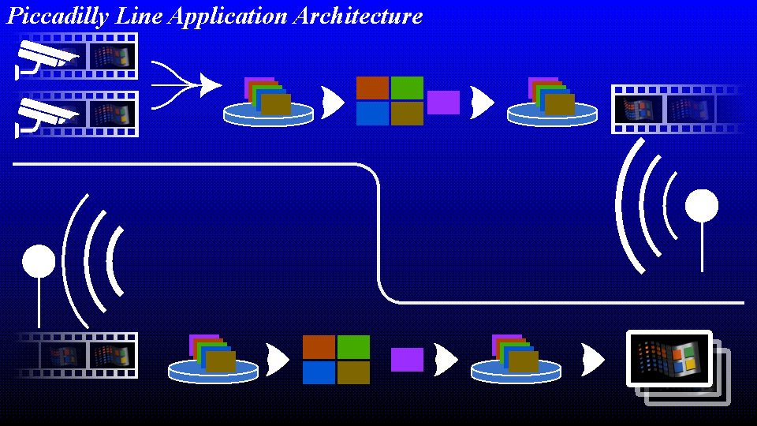

* Slide: Data flow from camera to monitors via radio transmission and
  reception.

This is the overview architecture of the Piccadilly line platform CCTV to
onboard display architecture.

## From Source to Compositor

We have discussed Sources and how they present their data to the compositor
now we see that the compositor will present the composited image to a Sink
that will encode the data and then transmit it to the train cab via Rinicom's
software defined radio product.

## I-frames

Normally I-frames are transmitted in their entirety at whatever interval is
deemed necessary for the application. This is acceptable for most situations
where streaming video is required and for largely error-free transports.
Unfortunately the bandwidth available to the radio is finite and interference
is expected to be common. This lead to the requirement that the display should
degrade gracefully.

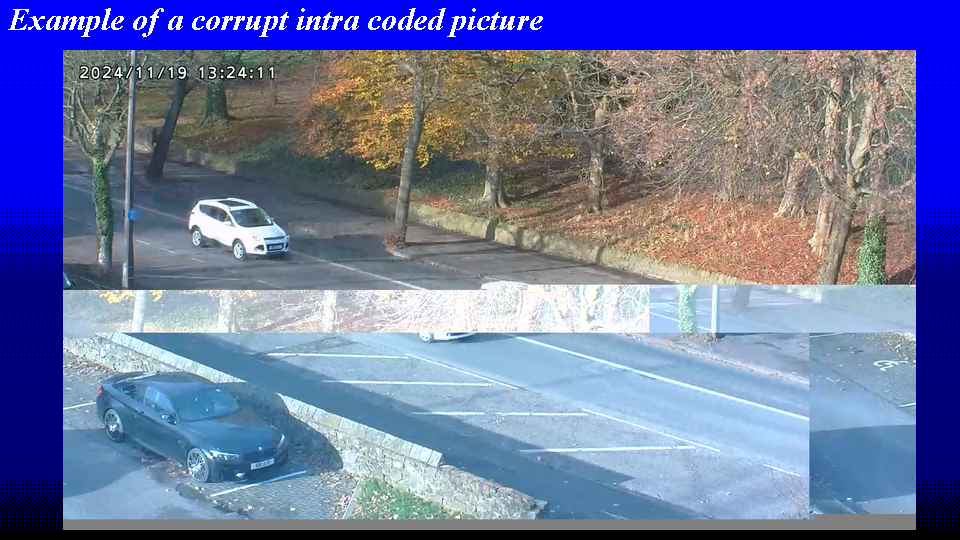

The large size of I-frames makes the likelihood of packet loss within fairly
high and loss of a parts of I-frames have a significant and far from graceful
degradation.

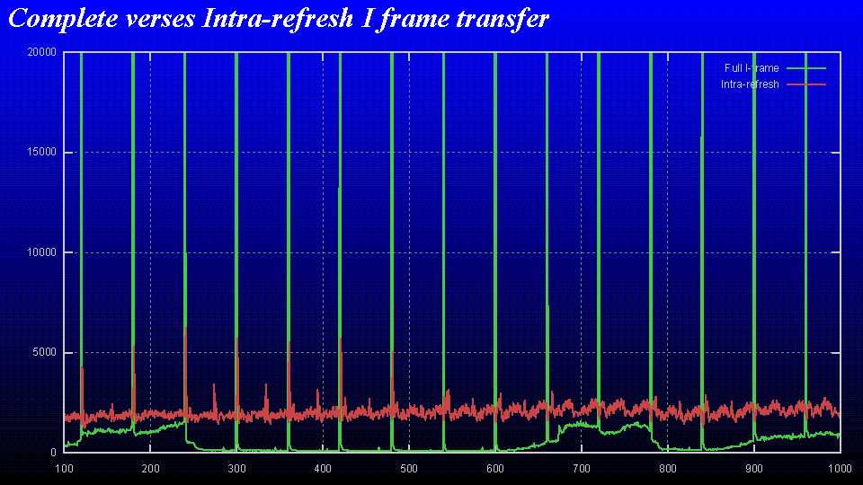

* Slide: Standard h.264 stream and an h.264 intra-refresh stream displayed
  in a line chart to demonstrate that iframes produce spikes.

The spikes in the green data stream here are I-frames, the red stream is
the same stream but one that makes use of the intra-refresh mode of h.264
operation.

Using this intra-refresh model means that the system is more resilient to
dropped packets since the available parts of the I frame can be used to
correctly render portions of the image, P and B frames then have a better
chance of referencing valid portions of the image. Unfortunately, the
intra-refresh mode is not well supported by hardware (it is a part of the
standard).

DEMO: Corrupt data stream for normal and intra-refresh video

This method does allow a more graceful recovery of the stream when packets are
lost, even so, it is important to try and minimise the unrecoverable packet
losses... I won't go into why.

To reduce the chance of a lost packet the burst format for radio transmission
contains a relatively basic form of FEC. FEC alone is a very interesting topic
and more information can be found in the normal places... I recommend looking
at a commonly used method of error correction that is not what we are about
to discuss: Reed-Soloman coding.

## XOR Redundant Packets

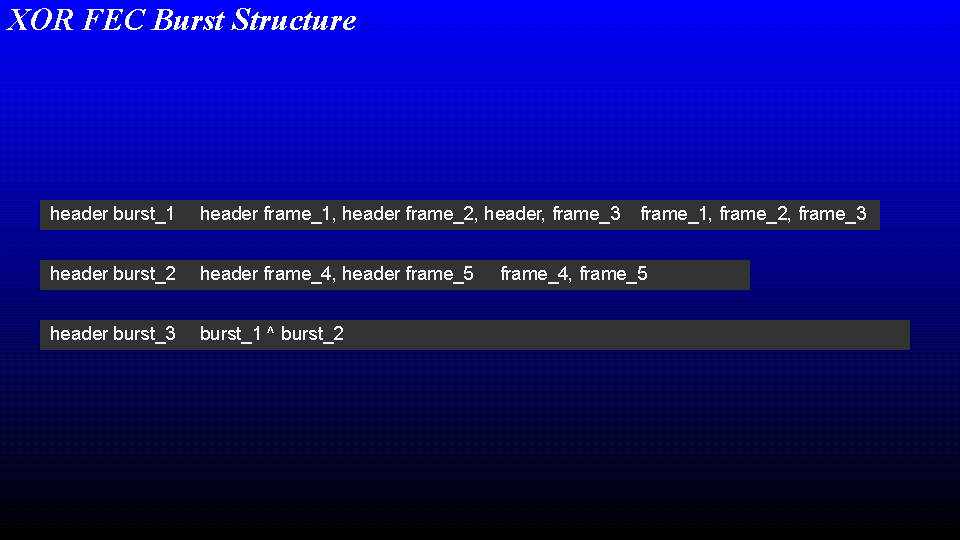

* Slide: The burst format used in the Rinicom SDR

A burst contains several frames (UDP, MQTT, IP, whatever). Each burst
contains a header that indicates the number of frames, the CRC, etc. And each
frame contains a header that indicates the size of the frame, the CRC,
location in the burst, etc. At the moment, it works like:

```
Send Burst1:
[header burst1] [header frame1, header frame2, header frame3] [frame1, frame2, frame3]
Send Burst2:
[header burst2] [header frame4, header frame5] [frame4, frame5]
Send Burst3:
[header burst3] [burst1 ^ burst2]
```

## Rinicom Software Defined Radio

Transmission and reception of video data is over the Rinicom software defined
radio product.

TODO: Specifications of Rinicom Radios here

## ...

