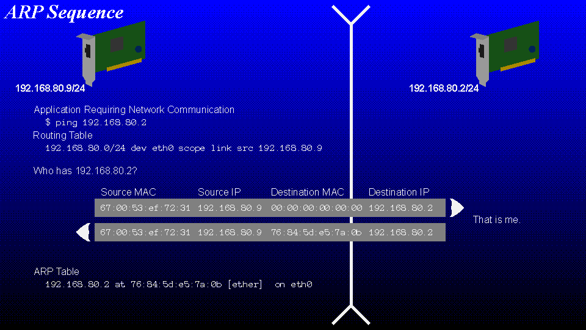
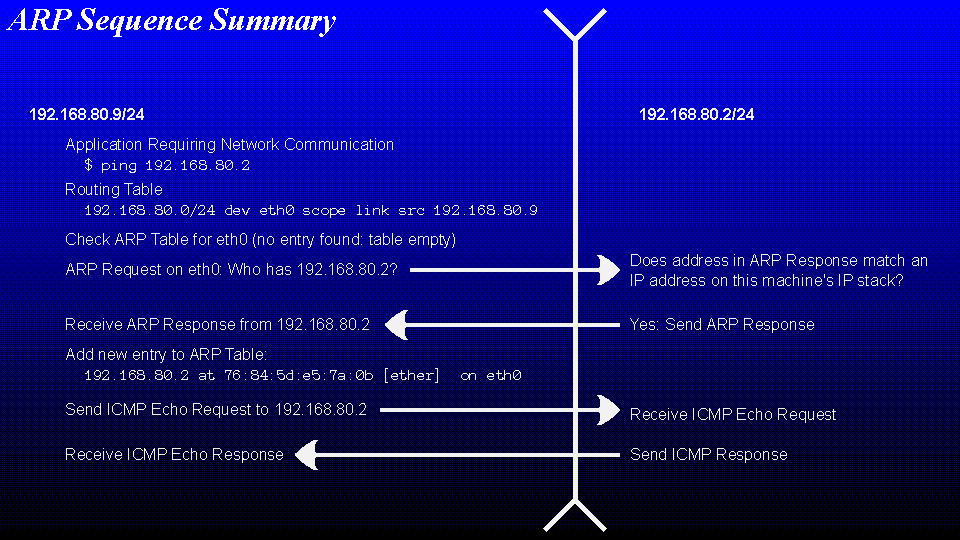
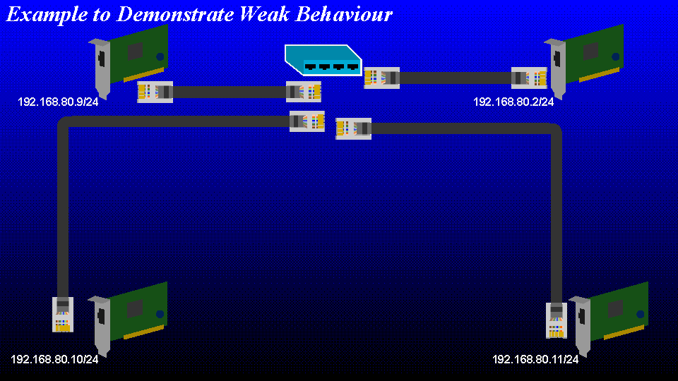

# The Linux TCP/IP Stack Default Weak End System Configuration



* Slide with ARP request pattern from two end systems

This is the way that the Linux IPv4 stack sends a packet of data to another
machine on the local network.

* Step 1: The local computer executes a command that requires the kernel to
  discover the address of a remote host, in this example that command is
  `ping` but any other command would follow a similar route.
  For simplicity there is no discussion of hostname resolution here,
  don't confuse hostnames and address spaces ala Stephen Fry!
  [Stephen Fry dot uk nominet launch](https://www.theregister.com/2014/06/10/stephen_fry_dot_uk_nominet_launch_wrong_on_ip_numbers/)
* Step 1.5: The IP stack will compose a message to be sent.
* Step 2: The IP stack will check with the routing table how to reach the
  address provided by the programme.
  Here we see that the address matches a "link-local" address (192.168.80.1-254)
  and so we will attempt to find the MAC address using the associated device.
* Step 2.5: Check the ARP table
  The ARP table (currently empty) will be checked to see if we already know
  the MAC address of the destination machine)
  We do not and so must find it.
* Step 3: Broadcast an ARP request.
  The ARP request is sent to all hosts on the broadcast domain.
  A broadcast domain is a common layer-2 segment connecting hosts together,
  examples include one or several ethernet switches that forward frames based
  on their MAC address.
* Step 4: All hosts connected to the broadcast domain will receive the ARP
  request and any host that has an logical interface assigned an address that
  matches the address in the request will respond with an ARP reply.
  Of course at this point any machines that receive the request may choose
  to cache the IP and MAC address of the sending host since it will probably
  come in handy later.
* Step 5: The requesting machine receives the ARP reply and will cache the
  IP and MAC address pair locally in the ARP table. This table can be queried
  at any time with the command `arp` on most Linux and Windows systems.
* Step 6: The packet composed earlier may now be sent to the destination
  machine.
* Step 7: The destination machine will receive the ethernet frame that was
  sent to its MAC address and the network stack will process it accordingly.

* Slide with HEX Dump of ARP Request
  Various addresses that are derived from an IP address and its mask
  Notations used when specifying an IP Address

This is an actual ethernet frame that contains the ARP request. The destination
address is the broadcast address (ff:ff:ff:ff:ff:ff) similar to an IP network
broadcast address whose host bits are all 1.



* Slide with Summary

Great, these two hosts can now communicate with each other, but notice how the
IP stack decides whether or not to respond... in both the case of the ARP
request and the ICMP Echo request the check that the IP stack performs is a
check that any configured interface matches the requested address.



* Slide with the problem

This is a typical network, the IP Address 192.168.80.2 is the internet router
and will NAT traffic in the usual manner. The other systems are normal client
machines and one of them will be given a new IP address on a different
interface. A dummy interface may be created like this:

```
modprobe dummy
ip link add dummy0 type dummy
ip link set up dev dummy0
ip addr add 192.168.90.10/24 dev dummy0
```

DEMO: Use virtual machines to demonstrate the unintuitive behaviour

So, with a weak host model it is possible to access services on the VPN IP
address from the local network.

Although this feature is necessary for some issues to arise that have been
flagged by various people as security problems it is not. This is intended
behaviour. However, since an address is assigned to an interface, intuition
or, as my friend likes to say "the principal of least surprise" is perhaps
bent a little by the weak host aka weak end system model.

Reference

* [CVE-2019-14899](https://seclists.org/oss-sec/2019/q4/122)
* [Linux Source Routing Strong End System Model](https://unix.stackexchange.com/questions/258810/linux-source-routing-strong-end-system-model-strong-host-model)
* [RFC 1122 section 3.3.4.2](https://www.rfc-editor.org/rfc/rfc1122#section-3.3.4.2)


