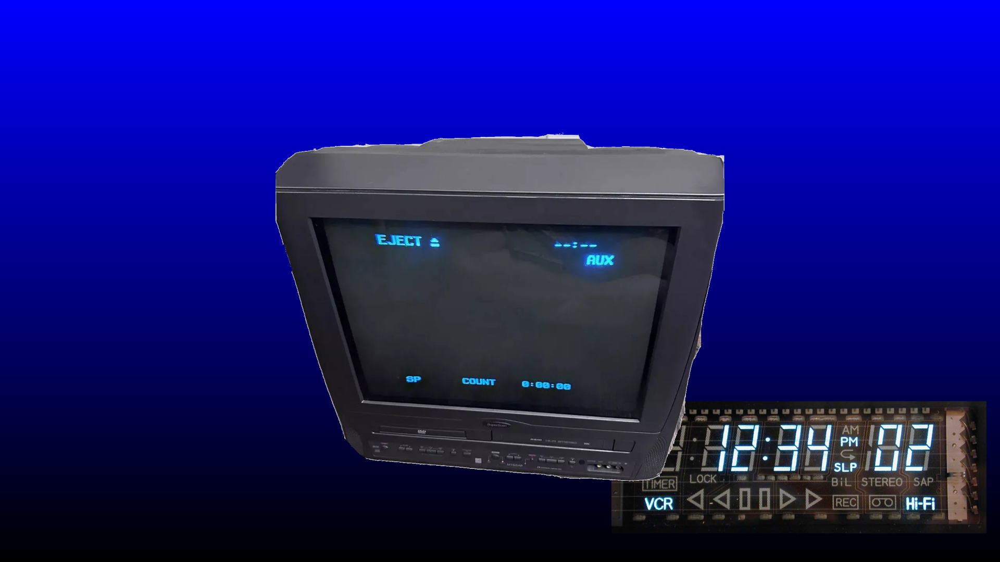
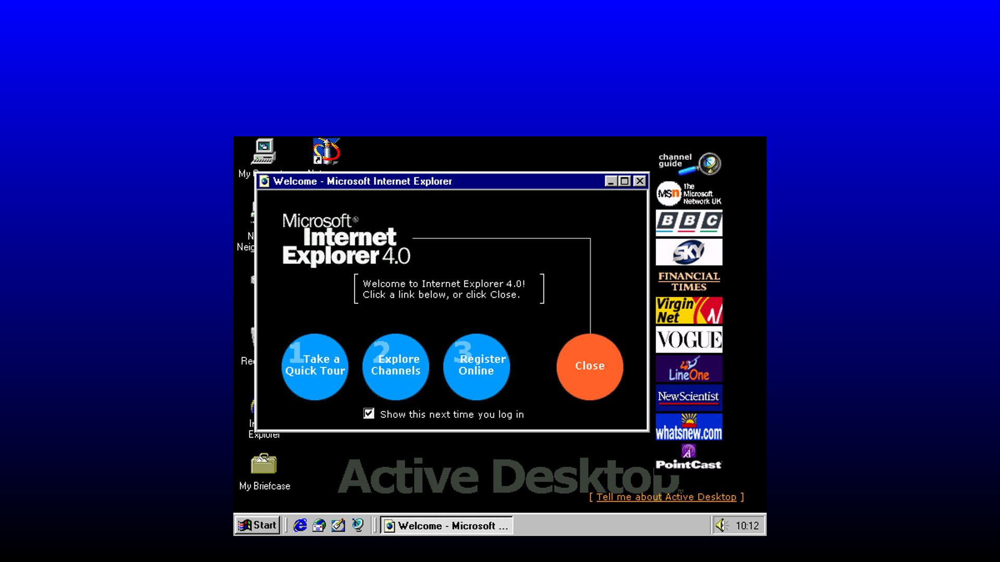
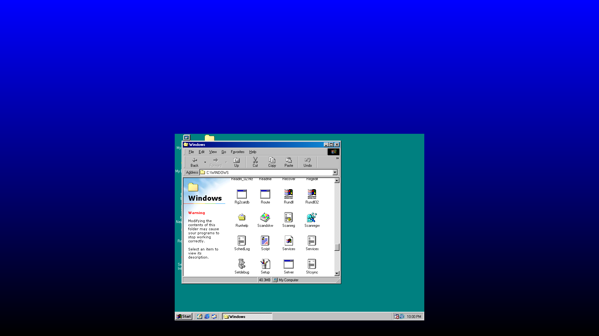
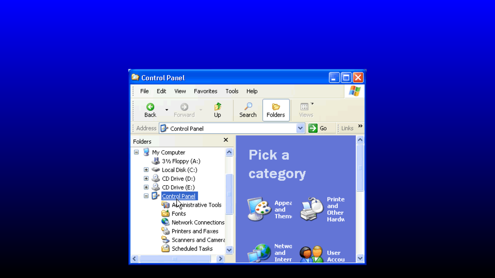
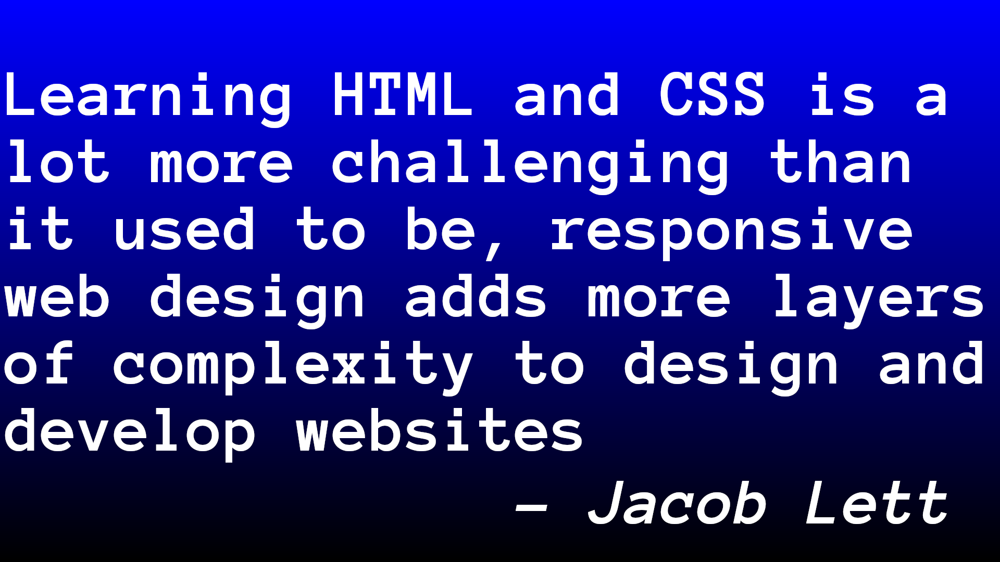
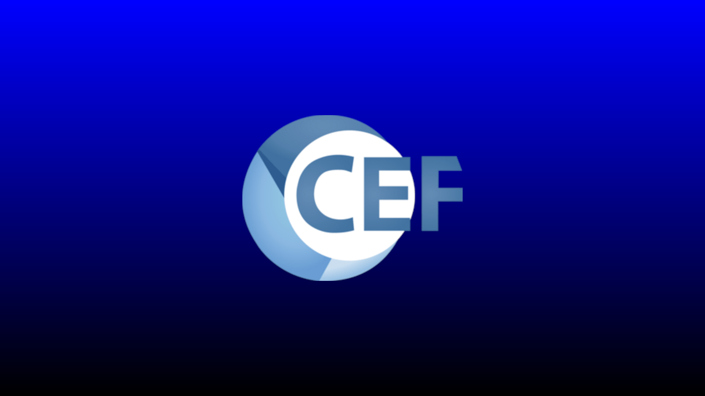
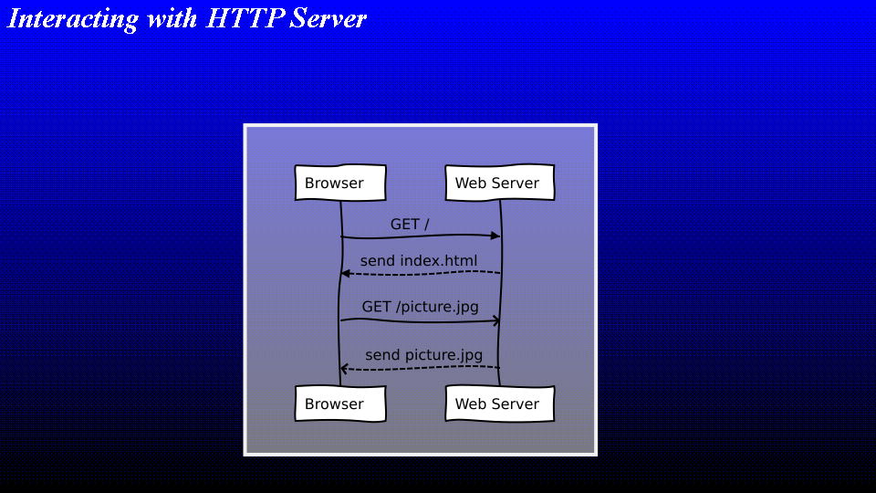
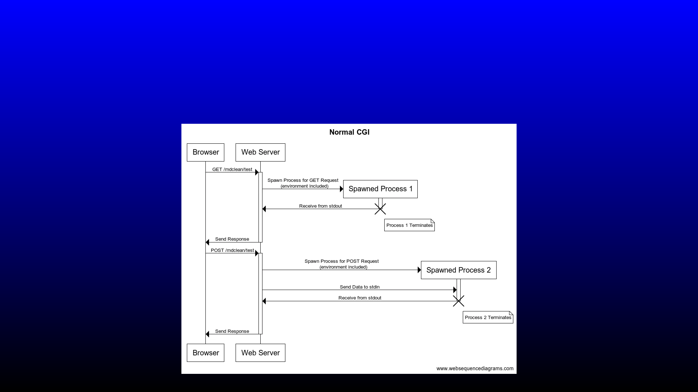
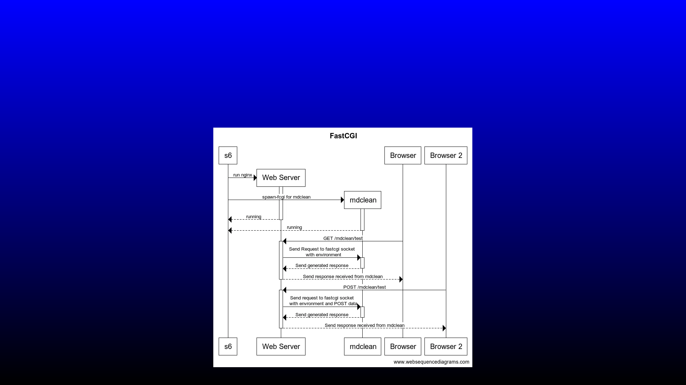

# Widgets

* Slide: A display with overlayed information

What is a Widget? Well, a widget for video wall is the name used for a small
programme that renders an image based on some information that can be
composited into the final image that will be displayed to the user.

Video wall makes use of Chromium Embedded Framework to render web pages into
a shared buffer that can then be composited into the final image.

## Motivation

* Slide: TV with OSD On Screen Display and VFD Vacuum Florescent Display

The benefits of a system able to overlay additional information are obvious,
the overlayed information allows the user to see additiona contextual
information without having to look away from the screen. Great in the 1980s
when the tiny display was all the way on the other side of the room!

Of course the OSD capability of video wall should be slightly better than this
after all, it has been a long time since the early 1980s.

Video wall needed a way to allow customisable on screen display programmes
to be written to allow third party customisation video wall incorporates a
web-browser that can be used by a customer to create an output buffer that
may then be composited by video wall to the final rendering.

The technique of incorporating a browser into a product to theoretically
improve it is not a new one...

* Slide: Atom, Microsoft Teams, Visual Studio Code

Atom: A Hackable Text Editor for the 21st Century

Teams: At the core technically inferior as a conferencing application but
successful because, well, Microsoft. Now completely out-grown itself adding
superfluous functionality.

Visual Studio Code: much like Atom the base of this monstrosity is the same
a full web-browser with all the bugs, quirks and performance inefficiency
that brings.

Even the Anaconda front-end for installing software on the Fedora Linux
distribution has decided to use a full web-browser to choose and install
packages.

Why is it this way? Then I thought about what came before. It all started
with Windows 95 and everyone's favourite web-browser Internet Explorer 4.0.

* Slide: Active Desktop with Internet Explorer 4.0 Welcome Splash.

This is quite pretty and possibly useful for some people, though I'm not
sure who. The next step was integration into the Windows file explorer
Windows 95 introduced a lovely class that was used in many different
scenarios: SysListView32, this is still present in modern Windows but in
Windows 98 the file explorer also had... HTML.

* Slide: Picture of Windows 98 with open file explorer

This area is rendered by something we now call a webview control. In the
glory days of Windows 98 the resolutions were lower and pixels much bigger
meaning the output had to be pixel-perfect. I wonder to myself if that was
one of the reasons that Internet Explorer had some of it's quirks? Did the
people working on Windows File Explorer...

* Slide: Windows XP Control Panel

Or the Windows Control Panel press the Internet Explorer developers to
support their applications?

In any case, the tentacles of the web-browser were embedded in places they,
arguably, should not be as early as IE4 and maybe earlier.

But why? What makes this particular technology so appealing that is has been
incorporated into so many different applications? Seemingly needlessly in
many cases... the answer is simple, when Tim Berners-lee invented the
internet, sorry World Wide Web, (yes I do know the difference but you would
be surprised how many people still think this way) it was intended to be a
simple tool to allow his colleagues to share information quickly. To allow
for this key requirement it was designed to be easy, since then the primary
motivator for adoption of web technologies has been "because it is easy,
and if it is easy then it can be cheap".

* Slide: Learn Web Technologies Quickly

Then we suddenly realised that, actually this stuff is becoming quite
complicated...

* Slide: Learning HTML and CSS is a lot more challenging than is used to be
  responsive web design adds more layers of complexity to design an develop
  websites. - Jacob Lett

Disclaimer: I don't know who Jacob Lett is or if he even said this but the
quote fits for my purpose so I put it on this slide.

It seems we transformed what was a cheap and easy utopia into something very
complicated and hard to understand. But ignore that for now, it does not fit
with the narrative. Web technologies are easy, most people can make a web
browser do something so why don't we make it easy to create a customisable
overlay with web technologies?

* Slide: Chromium Embedded Framework

Chromium Embedded Framework is a library that allows embedding of the chromium
engine into applications. The video wall uses chromium to render a web page
and provide an RGBA frame buffer to the compositor.

Well, we know all about the frames and writing HTML is simple, apparently,
but wait, doesn't a web page need a server, a back-end framework and various
support applications like databases? Well, yes, glad you asked.

Video wall uses CEF to render the page but it does need a server to load the
page from... really? Are you sure? Atom and VSCode don't need to load a page
from a web server do they? Ok, you got me but a page loaded from disk is
subject to strict browser security controls which, though we could probably
work around in software that was yet another problem we would rather avoid.

* Slide: Communication with Web Browser

HTML and other files (js, css and images) may be transferred using the HTTP
protocol which is fine for a static web page but in our widget scenario we
require the ability to render an image based on some value that comes from
the customer's application.

HTTP allows a browser to send data to a web page in many different ways, the
most common are query strings and POST requests. These methods are used
frequently in current web technologies but the request is only a part of the
story, implementation of the service at the back is also important.

All the content delivered by a normal web server or a CDN would be static,
that is to say that it is just a file and will not change. The browser would
normally only request the page once and then wait for user interaction.

* Slide: the meta refresh tag used to periodically reload a page

This tag can be used to periodically reload the current page without user
interaction. Using this method a page can be written that could be updated
on disk and then the updated contents will be presented when the browser
reloads the page. No javascript required... this feature is rarely used
by modern websites but browsers still support it:

* [Meta Refresh](https://en.wikipedia.org/wiki/Meta_refresh)

## CGI Scripting

* Slide: Communication Sequence Diagram for CGI processes

In the CGI model, each request is sent to a separate process, the process is
started the input passed to it and any output is relayed back to the user's
browser via the request channel. Simple.

These applications would often only perform
short and simple tasks, for example they might send an email, append to a
file or, in some cases append a record to a database. The executable may have
been a native binary or in many cases a perl script, the perl interpreter
must be loaded each time and then process the script. That includes processing
the generic configuration (if any exists) and connecting to database servers.
Once these setup tasks are complete the script can process the input provided
by the client and generate output.

For simple and low-traffic sites this is a completely valid solution, even
today, the problems begin to surface when a server is required to service
a large number of clients.

Traditional CGI scripting would work for video wall but in 2024 it might be
seen as a little antiquated. What has happened to the model since the early
90s?

* Slide: Communication Sequence Diagram for FastCGI processes

This model allows a single process to service many requests, thus removing
the process overhead. By having a long lived process it is also possible to
perform setup tasks before a client connects or, as is more common practice
to use a pool of resources which lives across multiple requests.
For example a database connection pool.

* Reference for learning more about [nginx, FastCGI and Docker](https://medium.com/@bengreen5/building-a-minimal-12-factor-application-with-fastcgi-c-and-docker-part-1-d0df60782)

## Requester

One additional issue with the above methods of requesting data from a server
is just that, the requester is the browser and in our case the widget would
be better architected to be notified of a change rather than continuously
polling the server.

TODO: Talk about how the page can be updated with:

* Long Polling
* Web Sockets

* DEMO: Web Page running a widget that can alter the content when a
  message is received via MQTT over a websocket connection

* DEMO: Video of digital twin rendered in a web browser

